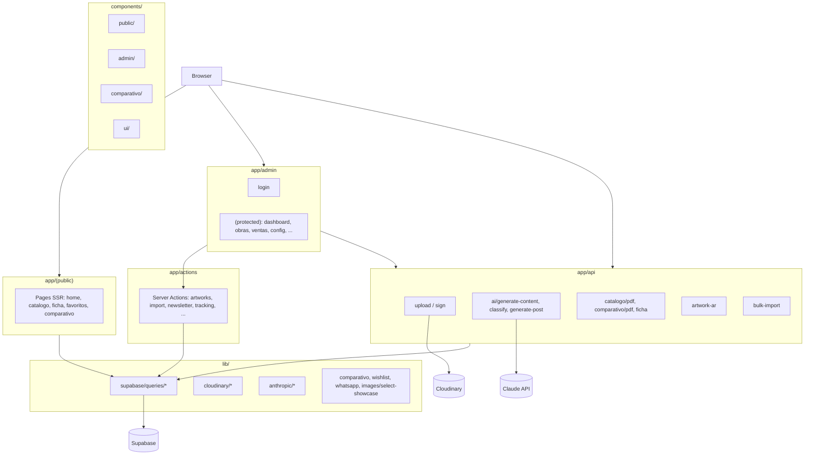

# Atelier 430 — Resumen del proyecto y arquitectura

> Documento de referencia: qué hace el producto hoy y cómo está organizado el código.  
> Actualizado: octubre 2026 · Mantenedor: Rick (Gamasoft IA Technologies S.A.S.)

---

## Qué es Atelier 430

**Galería digital privada** para administrar y **vender ~430 obras de arte** (liquidación de fábrica, antes en Liverpool/Palacio de Hierro). No es checkout en línea: el cierre es **WhatsApp** (B2C) y **PDF + atención personalizada** (B2B decoradoras/mueblerías). Un solo admin; el público navega catálogo, favoritos y herramientas visuales.

### Modelo de negocio

| Canal | Cómo se vende |
|-------|----------------|
| **B2C** | Catálogo web → consulta/compra por WhatsApp |
| **B2B** | Catálogo PDF + comparativo editorial + contacto |
| **Admin** | Rick único: inventario, precios, ventas, importación |

### Inventario (referencia)

- ~220 nacionales, ~96 europeas, ~41 modernas, ~77 religiosas  
- Con/sin marco según obra  
- Detalle operativo en `CLAUDE.md` y `docs/Atelier430_Design_System.md`

---

## Qué hace hoy (por área)

| Área | Funcionalidad |
|------|----------------|
| **Público** | Home, catálogo con filtros/búsqueda/paginación, fichas por código, categorías, favoritos (localStorage + Supabase), newsletter, WhatsApp con mensaje armado, SEO (OG, JSON-LD, sitemap) |
| **Experiencia visual** | Galería con lightbox/zoom, preview “en tu pared”, AR/model-viewer, **comparativo editorial** (3–5 obras a escala real, PNG/PDF), **escala de colección** |
| **Admin** | Login Supabase, dashboard (inventario + ventas), CRUD obras (wizard 5 pasos, imágenes Cloudinary), ventas, importación Excel+ZIP → borradores → publicación, posts para redes (Claude), newsletter (suscriptores), reportes, configuración (precios global, premium vs primary, comparativo, pricing masivo) |
| **IA (Claude)** | Título/descripción/tags, clasificación al importar, sugerencia de precios, posts Instagram/FB/WA Status |
| **PDFs** | Catálogo B2B, ficha por obra, comparativo editorial |
| **Tracking** | Vistas de obra y clics WhatsApp (RPC en Supabase) |

### Avance por fases

Según `docs/progress.md`:

- **Completadas:** Fases 0–8 (setup, auth, CRUD, IA, catálogo, wishlist, importación bulk, newsletter/posts, PDF + dashboard).
- **Extras:** Comparativo editorial, escala de colección, filtros comparativo fase 1 y 2, imágenes premium vs primary.
- **En curso / pulido:** Fase 9 (Lighthouse, testing mobile sistemático, dominio, Google Analytics).

---

## Stack tecnológico

```yaml
Frontend:
  framework: Next.js (App Router)
  language: TypeScript (strict)
  styling: Tailwind CSS
  components: shadcn/ui
  fonts: Sora (UI), Playfair Display (títulos de obras)
  forms: react-hook-form + zod
  animations: framer-motion (donde aplica)

Backend / servicios:
  database + auth: Supabase (PostgreSQL + Auth + RLS)
  images: Cloudinary (upload firmado, transforms)
  ai: Anthropic Claude API
  email: Resend (newsletter)
  hosting: Vercel

Dev:
  package_manager: npm
  linter: ESLint
  git: conventional commits
```

---

## Arquitectura de capas

```text
Next.js (App Router) + TypeScript + Tailwind + shadcn/ui
     │
     ├── Supabase     → PostgreSQL, Auth, RLS, RPC tracking
     ├── Cloudinary   → imágenes (upload firmado, transforms, carpetas canónicas)
     ├── Anthropic    → contenido / clasificación / posts
     ├── Resend       → bienvenida newsletter
     └── Vercel       → hosting
```

### Diagrama de flujo (alto nivel)



---

## Estructura de carpetas (convención)

| Ruta | Rol |
|------|-----|
| `app/(public)/` | Sitio editorial: layout, header, footer, WhatsApp flotante, rutas públicas |
| `app/admin/` | Panel: `login` + `(protected)/` con sidebar y páginas admin |
| `app/api/` | Route handlers: PDF, upload, IA, AR, importación |
| `app/actions/` | Server Actions para mutaciones desde formularios admin |
| `components/public/` | UI del catálogo y fichas |
| `components/admin/` | UI del panel (tablas, wizard, importación) |
| `components/comparativo/` | Selector, lámina a escala, export |
| `components/ui/` | Base shadcn/ui |
| `lib/supabase/` | Cliente browser/server/middleware + `queries/*` |
| `lib/cloudinary/` | Upload, transforms, normalización |
| `lib/anthropic/` | Cliente, prompts, servicios de análisis/clasificación |
| `lib/comparativo/`, `lib/wishlist/`, `lib/whatsapp/` | Dominio específico |
| `types/` | Tipos TypeScript (artwork, catalog, database, import) |
| `hooks/` | Hooks compartidos (wishlist, swipe, pinch zoom, etc.) |
| `supabase/migrations/` | Schema SQL versionado |
| `scripts/` | Mantenimiento Cloudinary/Supabase (npm scripts) |

Especificación detallada de carpetas y features MVP: `docs/Atelier430_Design_System.md`.

---

## Rutas principales

### Público

| Ruta | Propósito |
|------|-----------|
| `/` | Home: hero, destacadas, categorías, newsletter |
| `/catalogo` | Listado filtrable (URL = filtros + paginación) |
| `/catalogo/[code]` | Ficha de obra: galería, specs, WhatsApp, relacionadas |
| `/categoria/[slug]` | Catálogo acotado por categoría |
| `/favoritos` | Wishlist; compartir lista por `?list=` |
| `/comparativo` | Comparativo editorial (3–5 obras, `?obras=`) |
| `/escala-coleccion` | Visualización a escala de la colección |

### Admin (protegido)

| Ruta | Propósito |
|------|-----------|
| `/admin/login` | Auth Supabase |
| `/admin/dashboard` | Métricas inventario y ventas |
| `/admin/obras` | Listado, filtros, PDF catálogo |
| `/admin/obras/nueva`, `/admin/obras/[id]` | Crear/editar obra |
| `/admin/obras/importar` | Excel + ZIP → borradores |
| `/admin/obras/importar/revision` | Publicar borradores |
| `/admin/ventas` | Historial de ventas |
| `/admin/newsletter` | Suscriptores |
| `/admin/comparativo` | Vista admin del comparativo |
| `/admin/reportes` | Reportes de inventario |
| `/admin/configuracion` | Settings globales (precios, imágenes, comparativo, etc.) |

### API (selección)

| Endpoint | Propósito |
|----------|-----------|
| `/api/upload/sign`, `/api/upload` | Firma Cloudinary y DELETE |
| `/api/ai/generate-content`, `classify-artwork`, `generate-post` | IA |
| `/api/catalogo/pdf` | PDF catálogo B2B |
| `/api/artworks/[code]/ficha` | PDF ficha de obra |
| `/api/comparativo/pdf` | PDF comparativo |
| `/api/artwork-ar/[code]` | Assets AR |
| `/api/admin/bulk-import` | Importación masiva |
| `/api/template/excel` | Plantilla Excel |

---

## Datos, imágenes y configuración

### Modelo de datos (conceptual)

- **`artworks`** — obra: código, categoría, medidas, marco, precio, `show_price`, estado (`available`, `reserved`, `sold`, `draft`, …).
- **`artwork_images`** — fotos en Cloudinary; flags **`is_primary`** (técnica/plana) e **`is_premium`** (venta/lifestyle).
- **`sales`** — ventas registradas desde admin.
- **`wishlist_items`** — favoritos por `session_id`.
- **`newsletter_subscribers`** — emails suscritos.
- **`site_settings`** — claves JSON, por ejemplo:
  - `show_prices_globally` — mostrar/ocultar precios en público
  - `prefer_premium_in_catalog` — premium vs primary en catálogo
  - copy y defaults del comparativo, defaults al crear obra

### Imágenes (Cloudinary)

Convención de carpetas:

```text
atelier430/artworks/<CÓDIGO>/<CÓDIGO>-<sufijo>
```

Upload directo con firma SHA1 en servidor (`api_secret` no expuesto). Obras nuevas pueden subir primero a `tmp-*` y normalizarse al guardar o con scripts `npm run cloudinary:*`.

Selector centralizado: `lib/images/select-showcase.ts` (`selectPrimaryImage`, `selectPremiumImage`, `selectShowcaseImage`).

### Seguridad

1. **`middleware.ts`** — refresco de sesión Supabase en cada request; redirección a login en `/admin/*` sin sesión.
2. **Layout `(protected)`** — segunda verificación server-side.
3. **RLS** en Postgres — acceso público solo a obras publicadas; escritura admin autenticada.
4. **Service role** — solo en servidor y scripts, nunca en cliente.

---

## Patrones de rendering

- **Server Components** por defecto en páginas de catálogo (datos + SEO).
- **`'use client'`** donde hace falta interactividad: galería, filtros, wishlist, comparativo picker, formularios admin.
- **URL como fuente de verdad** en catálogo y comparativo (`searchParams`).
- **Server Actions** para CRUD obras, import, newsletter, tracking fire-and-forget.

---

## Integraciones externas

| Servicio | Uso en el producto |
|----------|-------------------|
| **Supabase** | Fuente de verdad; auth admin; RPC tracking |
| **Cloudinary** | CDN y transforms; presets por contexto (card, lightbox, PDF) |
| **Anthropic** | Vision + texto: fichas, clasificación bulk, posts sociales |
| **Resend** | Email de bienvenida al suscribirse |
| **WhatsApp** | Enlaces `wa.me` con mensaje prellenado (variable `NEXT_PUBLIC_WHATSAPP_NUMBER`) |

---

## Scripts de mantenimiento

Definidos en `package.json` → `scripts/`. Requieren `.env` con credenciales Supabase/Cloudinary.

| Comando | Uso |
|---------|-----|
| `npm run inspect:artwork -- <CODE>` | Diagnóstico de obra en BD e imágenes |
| `npm run recode:artwork -- <CODE>` | Recodificar obra y assets Cloudinary |
| `npm run cloudinary:migrate` | Mover imágenes a carpetas canónicas |
| `npm run cloudinary:cleanup` | Borrar assets huérfanos |
| `npm run cloudinary:purge-folders` | Limpiar carpetas `tmp-*` / `IMP-*` |
| `npm run purge:dev` | Limpiar datos de prueba (con `--dry-run` primero) |

Detalle completo: sección «Scripts utilitarios» en `CLAUDE.md`.

---

## Documentos relacionados

| Archivo | Contenido |
|---------|-----------|
| `CLAUDE.md` | Contexto persistente para desarrollo (convenciones, flags premium/primary, scripts) |
| `docs/progress.md` | Avance por fases y checklists operativos |
| `docs/Atelier430_Design_System.md` | Especificación maestra (design system, MVP, SQL) |
| `docs/Atelier430_Guia_Fotografia.md` | Guía de fotografía de obras |
| `.env.example` | Variables de entorno requeridas |

---

## Resumen en una frase

**Monolito Next.js** con cara pública de galería editorial y panel admin, **Supabase como backend**, **Cloudinary como CDN de fotos**, **Claude como asistente de contenido e importación**, y **venta fuera del sitio** vía WhatsApp y PDFs.
